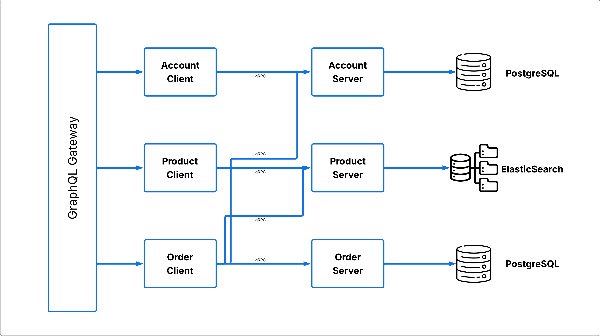
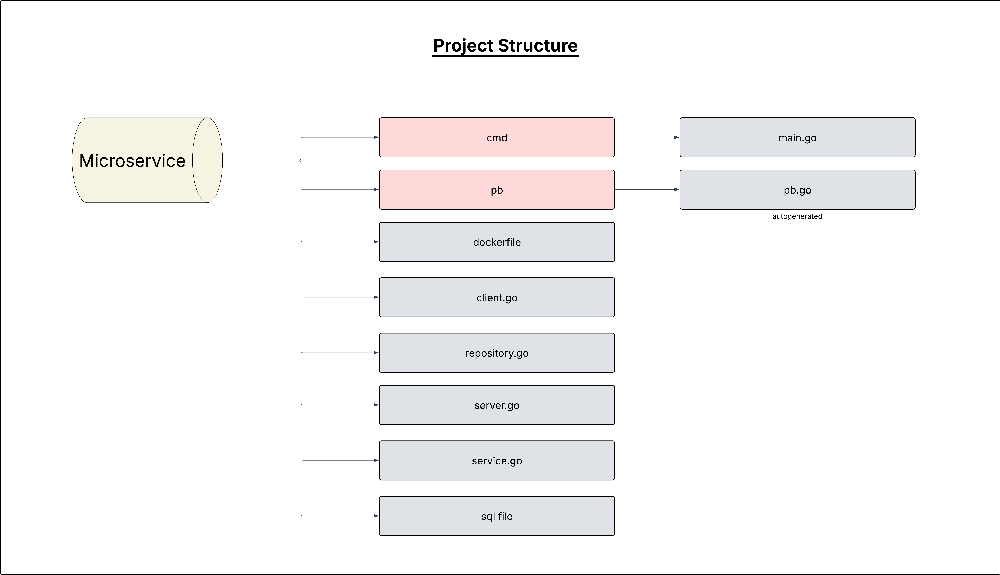
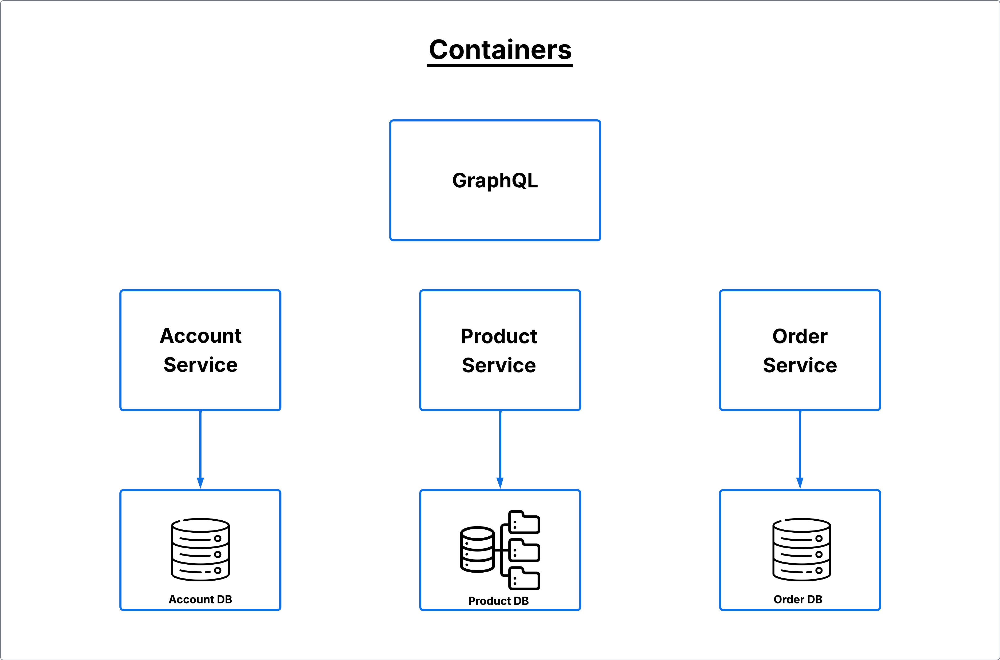
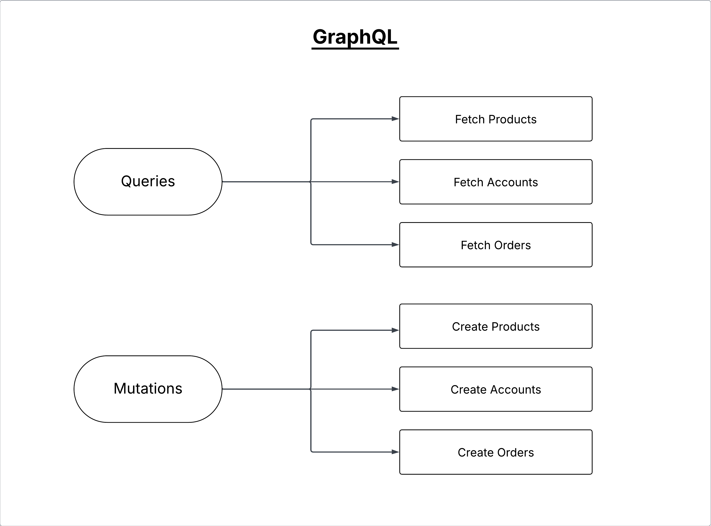
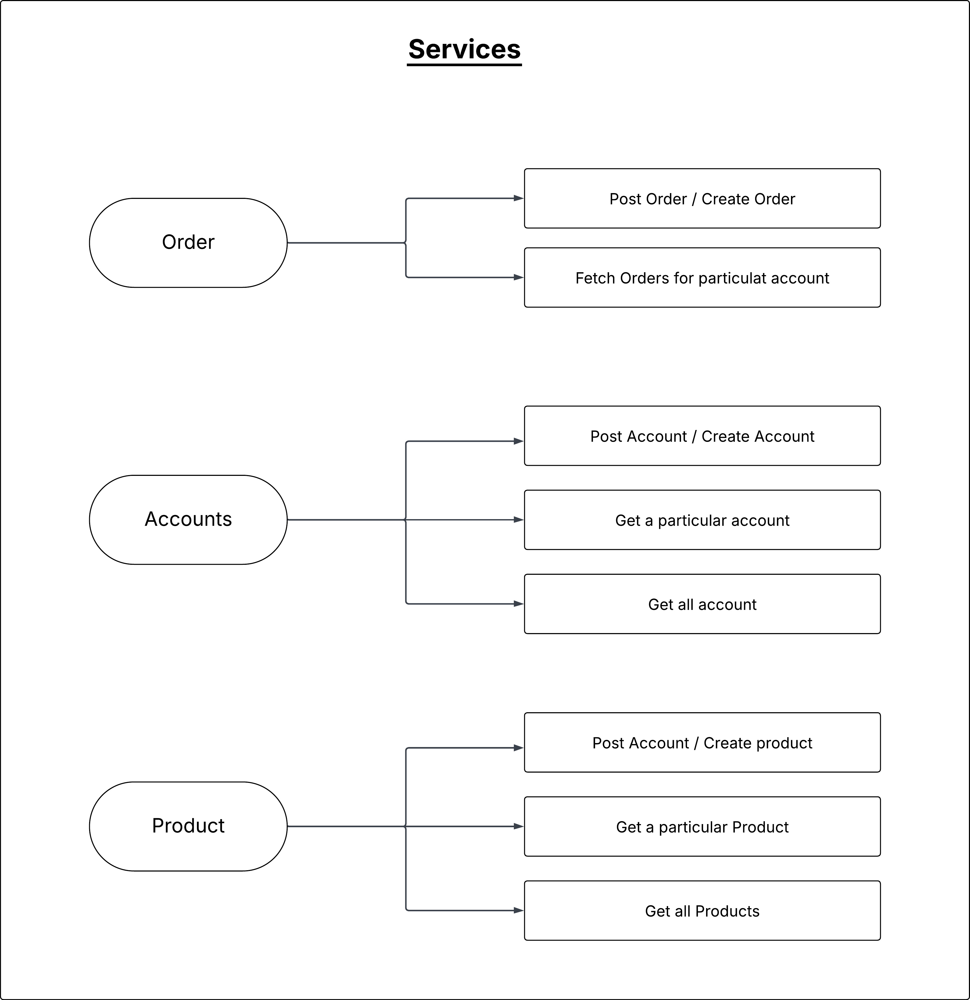

# Minimum-Viable-Shop

A minimal, production-ready foundation for an e-commerce shop. It uses modular services, a GraphQL API layer, and containerized deployment to keep development fast while remaining scalable and maintainable.

## Architecture Overview

This diagram shows the high-level system: client applications talk to a GraphQL/API layer, which orchestrates calls to domain services (catalog, cart, orders, payments, user/auth, etc.) backed by their own data stores. Cross-service communication mixes synchronous requests with asynchronous events for decoupling and reliability. Observability (logs/metrics/traces) and CI/CD wrap the stack for operational readiness.

## Project Structure

This view outlines how the repository and components are organized: a UI/app surface, an API layer, domain services, shared libraries/utilities, and infrastructure (containers, config, deployment). The structure aims for clear boundaries, discoverable code, and a simple path to extend or replace pieces without ripple effects.

## Containers Topology

This diagram depicts the containerized runtime: each service runs in its own container with explicit network boundaries, environment configuration, and persistent volumes where needed (databases, message brokers). Local development typically uses Docker Compose; production targets Kubernetes or similar for scaling and rollout control.

## GraphQL Layer

The GraphQL layer provides a unified API surface composed from underlying services. Resolvers coordinate data fetching, and use batching/caching to reduce N+1 calls. The schema exposes key queries (e.g., products, cart) and mutations (e.g., addToCart, checkout), handling authentication, authorization, and error mapping consistently.

### GraphQL Schema

The API exposes core types and inputs, with queries for lists and mutations for creation. The schema below reflects the main entities and relationships:

```graphql
type Account {
  id: ID!
  name: String!
  orders: [Order!]!
}

type Product {
  id: ID!
  name: String!
  description: String!
  price: Float!
}

type OrderedProduct {
  id: ID!
  name: String!
  description: String!
  price: Float!
  quantity: Int!
}

type Order {
  id: ID!
  name: String!
  description: String!
  totalPrice: Float!
  products: [OrderedProduct!]!
}

input AccountInput {
  name: String!
}

input ProductInput {
  name: String!
  description: String!
  price: Float!
}

input OrderProductInput {
  id: ID!
  quantity: Int!
}

input OrderInput {
  accountId: ID!
  products: [OrderProductInput!]!
}

type Query {
  accounts: [Account!]!
  products: [Product!]!
}

type Mutation {
  createAccount(input: AccountInput!): Account!
  createProduct(input: ProductInput!): Product!
  createOrder(input: OrderInput!): Order!
}
```

Relationships:
- Accounts contain orders
- Orders contain ordered products with quantity and price
- Products are referenced within orders through OrderedProduct
- Mutations create accounts, products, and orders; queries list accounts and products

## Domain Services

Core services encapsulate business capabilities: product/catalog, inventory, pricing, cart, checkout/order, payment, user/auth, shipping, and notifications. Services interact via well-defined contracts; synchronous calls handle request-response flows while events (e.g., OrderCreated) propagate state changes for downstream processing and projections.
